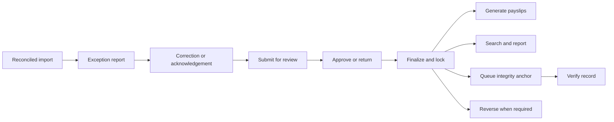

# Post-Pre-Oral Implementation Plan

**Project:** Payroll Management System  
**Version:** 1.0  
**Date:** September 15, 2026  
**Built on:** Baseline B2 and CR-01 — see [baseline.md](./baseline.md) and [change-request-cr-01.md](./change-request-cr-01.md)  
**Follows:** [pre-oral-demonstration-plan.md](./pre-oral-demonstration-plan.md)  
**Status:** Working document. **Not part of the frozen baseline.**

---

# 1. Purpose and starting point

The pre-oral increment proves the governed intake boundary: employee and attendance data becomes an input worksheet, the accounting office returns a computed register, and the system accepts it only when its arithmetic, control totals, and population reconcile. This plan completes the system after that demonstration.

The post-pre-oral build must not reopen the computation decision. The system still **does not compute payroll**. The accounting office computes the register; this system validates, governs, preserves, approves, presents, and reports it.

The starting gate is the pre-oral handoff:

- The 14-use-case pre-oral slice is demonstrated and its evidence is retained.
- The intake fidelity and reconciliation-refusal suites remain green.
- The physical offline/staging rehearsal is either completed or recorded as the first post-pre-oral action.
- Any newly discovered requirement is handled through the baseline change procedure before code is changed.

---

# 2. Completion target

The post-pre-oral release is complete when one payroll period can move through this full lifecycle:

The release must provide:

1. M5 validation, correction, approval, finalization, locking, and reversal.
2. M6 payslip generation, batch export, and reprint.
3. M7 record search, reports, statutory employer-share derivation where required, and backup/restore.
4. M1 integrity screens and the asynchronous ledger anchoring path.
5. Performance, security, usability, deployment, and acceptance evidence for Chapter IV.

---

# 3. Non-negotiable boundaries

| Boundary | Rule |
|---|---|
| Payroll computation | Remains in the accounting office's spreadsheet. Do not add a computation engine or describe the system as calculating pay. |
| Imported values | Monetary values remain decimal strings/`DECIMAL(13,2)`; no float conversion and no reconciliation tolerance. |
| Finalized records | Immutable in the application and database. Corrections use return-before-finalization, superseding import, adjustment where allowed, or reversal after finalization. |
| Audit | Every state-changing action is attributed and hash-chained. Negative permission tests remain required. |
| Ledger | Anchoring is asynchronous through the transactional outbox. Ledger outage must never block finalization or payslip generation. |
| Scope | Requirements remain those in B2. A missing or changed requirement is a baseline change, not an informal implementation task. |

---

# 4. Delivery sequence

The schedule assumes eight weeks after the pre-oral freeze, with three or four people working in parallel. The order follows the dependency chain: approval before payslips, finalized records before reporting, and the ledger after the payroll lifecycle is stable.

| Phase | Weeks | Delivers | Exit condition |
|---|---:|---|---|
| **P0 — Handoff and staging gate** | 9 | Physical offline deployment, staging reset, pre-oral evidence archive, open-item decisions | A clean artifact installs and runs on the disconnected staging machine; the pre-oral slice is reproducible |
| **P1 — Validation and approval** | 9–10 | M5: exception evaluation, register review, corrections, submit/return/approve/finalize/reverse, period lock | A clean run completes the state machine; every invalid transition and separation-of-duty case is refused |
| **P2 — Payslips** | 11 | M6: stored-value payslip rendering, batch export, reprint, finalized-run guard | A complete 30-employee payslip set is generated within five minutes and cannot be generated from an unfinalized run |
| **P3 — Records and reports** | 12–13 | M7: retained records, search, report catalogue, statutory schedules, employer-share derivation, backup/restore | Past records are retrievable within one minute; reports identify imported versus derived values; restore produces a verifiable system |
| **P4 — Integrity layer** | 13–14 | Besu gateway, anchor outbox, finalize/reversal anchors, verification screen, mismatch and unverifiable states | Finalization is independent of ledger availability; verification detects a changed record and reports an unavailable ledger distinctly |
| **P5 — Hardening and acceptance** | 15–16 | Performance testing, security review, usability evaluation, documentation, UAT, deployment runbook, final rehearsal | All Must requirements have evidence, the acceptance script passes, and a person outside the build team can deploy and operate the system |

P3 and P4 may overlap after the M5 contract is stable. Do not start ledger integration by changing the finalization transaction; the outbox is the architectural boundary.

### Weekly implementation schedule

| Week | Phase | Primary work | Ends with |
|---|---|---|---|
| **W9** | P0 / P1 | Complete the physical offline deployment, reset staging from the release artifact, archive the pre-oral evidence, close OI-09, OI-13, OI-14, OI-06, OI-10, and OI-11, and start the M5 exception and correction flow. | Staging installation is reproducible; the pre-oral slice passes regression; the first exception report and correction path work on staging. |
| **W10** | P1 | Finish submit, return, approve, finalize, cancel, reverse, period locking, immutable finalized lines, audit entries, transition records, and separation-of-duty checks. | **Milestone P-B:** a clean payroll run completes the governed state machine, and invalid or unauthorized transitions are refused. |
| **W11** | P2 | Build stored-value payslip rendering, employee metadata, batch PDF export, reprint, imported/derived labels, and finalized-run guards. | **Milestone P-C:** a 30-employee finalized run produces a complete payslip batch within five minutes and an unfinalized run is refused. |
| **W12** | P3 | Implement record search, role-filtered retrieval, pagination, the report catalogue foundation, and retained-record views. | Search returns the correct employee, period, and run records within the target response time. |
| **W13** | P3 / P4 | Complete statutory schedules, employer-share derivation where applicable, report outputs, scheduled backup and restore; begin integrity hashes and the transactional anchor outbox. | **Milestone P-D:** reports distinguish imported from derived values, and a restored backup passes integrity verification. |
| **W14** | P4 | Complete Besu gateway integration, retry handling, finalize/reversal anchors, verification screens, mismatch detection, and unavailable-ledger states. | **Milestone P-E:** ledger outage does not block finalization, and tampering, mismatch, and unverifiable outcomes are demonstrated. |
| **W15** | P5 | Run performance, security, permission, usability, and accessibility checks; resolve defects; update the evidence pack, traceability matrix, and user and administrator runbooks. | All Must requirements have indexed evidence, and the acceptance script is ready for an operator outside the build team. |
| **W16** | P5 | Execute UAT, ISO/IEC 25010 evaluation, clean-database test suite, Pint, production asset build, deployment rehearsal, backup/restore rehearsal, and final staging walkthrough. | **Milestone P-F:** the release artifact passes acceptance, two complete final rehearsals are recorded, and the handover package is complete. |

---

# 5. Work packages

## 5.1 P0 — Handoff and staging gate

- Run `migrate:fresh --seed` and archive the exact artifact, commit, PHP/Node/MySQL versions, and seed counts.
- Complete the physical no-network deployment rehearsal and update [deployment-rehearsal.md](./deployment-rehearsal.md).
- Run both pre-oral rehearsals or record the remaining human action and its owner.
- Resolve the pre-oral fixture question: retain `register_clean.xlsx` as the corrected file unless a distinct fourth fixture is required.
- Confirm OI-09, OI-13, OI-14, OI-06, OI-10, and OI-11 before the modules that consume them.

## 5.2 P1 — Validation and approval

Implement the complete M5 lifecycle:

- `ExceptionEvaluator` for all blocking and warning rules.
- Exception report with named employee, row, field, severity, and resolution path.
- Payroll register review and targeted correction.
- Adjustment and superseding-import paths without mutating historical versions.
- Submit, return, approve, finalize, cancel, and reverse transitions.
- Period locking, immutable finalized lines, confirmation for destructive actions, and two-place separation-of-duty enforcement.
- Audit entries and `RUN_TRANSITION` records for every transition.

The first focused test is the state-machine suite. It must cover both successful transitions and refusals, including concurrent or stale transition attempts.

## 5.3 P2 — Payslips

Implement M6 against stored imported values only:

- Payslip layout and employee/pay-period metadata.
- Earnings, deductions, imported net pay, and clear imported/derived labelling where relevant.
- Batch PDF generation and download.
- Reprint from retained records without recomputation.
- Refusal for Draft, For Review, Approved, or reversed runs.

The performance test must use the full validation population, not a three-row fixture.

## 5.4 P3 — Records, reports, and operations

Implement M7 and the M1 administrative operations that support it:

- Search by employee, period, and run; role-filtered retrieval and pagination.
- The eleven-report catalogue, with priority confirmed against OI-06 and OI-07.
- Effectivity-dated statutory schedules and employer-share derivation only for remittance reports when the register omits those shares.
- Explicit labels for imported versus derived values; no derived employer share changes employee net pay.
- Scheduled backup, documented restore, and post-restore integrity verification.

## 5.5 P4 — Integrity layer

Implement the architecture already specified in [system-architecture.md](./system-architecture.md):

- Hash finalized run totals, payroll lines, bound import versions, and reversal records.
- Write a pending anchor in the same transaction as finalization or reversal.
- Transmit and retry through the outbox after commit.
- Show pending, anchored, mismatch, and unverifiable states.
- Persist verification outcomes and expose both local and ledger hashes.
- Test that an unreachable ledger does not block payroll operations.

The release claim is limited to: **a finalized run cannot be altered without detection when the external ledger arrangement is administered separately.**

## 5.6 P5 — Hardening, acceptance, and handover

- Run the full PHPUnit/feature suite from a clean database.
- Run Pint and the production asset build.
- Execute NFR-3.5, NFR-5.5, NFR-5.4, NFR-6.3, NFR-6.5, and NFR-6.6 evidence procedures.
- Walk every primary use case with the four roles, including negative permission and invalid-transition cases.
- Update the evidence pack, deployment rehearsal, traceability matrix, Chapter IV results inputs, and user/administrator runbooks.
- Perform two complete final rehearsals from the release artifact on staging.

---

# 6. Milestones and schedule valve

| Milestone | Target | Evidence |
|---|---:|---|
| **P-A: Staging handoff** | End W9 | Offline installation, clean migration, seeded reset, pre-oral regression |
| **P-B: Governed payroll lifecycle** | End W10 | Exception report, correction, approval, finalization, reversal tests and demonstration |
| **P-C: Employee-facing output** | End W11 | Timed payslip batch, finalized-run guard, reprint test |
| **P-D: Operational records** | End W13 | Search timing, report outputs, backup and restore result |
| **P-E: Integrity complete** | End W14 | Anchor lifecycle, outage test, mismatch and unverifiable verification results |
| **P-F: Release accepted** | End W16 | UAT, ISO/IEC 25010 survey, runbook installation, two rehearsals, evidence index |

If time is lost, preserve the full M5 lifecycle, payslips, records/search, and backup/restore first. The ledger may move to a documented final phase only if the baseline and manuscript explicitly record that FR-6.3 is not yet complete; it must not be silently omitted. Styling, report polish, and nonessential export convenience are cut before acceptance evidence or business controls.

---

# 7. Definition of done

A feature is done when its acceptance criteria are observable, its normal and refusal paths are tested, its permission is enforced server-side, its action is audited, and its evidence is indexed.

An increment is done when it migrates from an empty database, reproduces from seeders, runs on staging from the release artifact, and passes its relevant performance and acceptance checks.

The project is done when:

- Every B2 Must requirement is either passed or has an approved baseline change.
- A payroll run completes from imported register through approval, finalization, payslip, record, report, and integrity verification.
- Reversal, backup/restore, ledger outage, tampering, unauthorized access, and invalid transitions are demonstrated as controlled outcomes.
- NFR-2.12 remains green for 30 employees across three periods in both directions.
- NFR-3.5 and NFR-5.5 meet their thresholds on staging.
- NFR-6.6 reaches the specified ISO/IEC 25010 target or the result is reported honestly.
- A person following the runbook can install, reset, operate, back up, restore, and verify the system without the build team.

---

# 8. Evidence register to maintain

| Evidence | Owner | Captured by |
|---|---|---|
| State transition and refusal suite | Application / persistence | P1 |
| Exception rule and correction results | Domain / intake | P1 |
| Payslip batch timing and reprint | Presentation | P2 |
| Search timing and report catalogue outputs | Presentation / persistence | P3 |
| Backup and full restore comparison | Infrastructure | P3 |
| Ledger anchor, outage, mismatch, and unverifiable outcomes | Infrastructure / integrity | P4 |
| Role-by-role UAT and negative permission results | QA / project lead | P5 |
| ISO/IEC 25010 survey and analysis | Project lead | P5 |
| Final artifact checksum, migration log, and deployment record | Infrastructure | P5 |

Each entry records the command or procedure, environment, date, result, requirement IDs, and artifact path. Evidence captured only in the final week is considered at risk until reproduced.

---

# 9. Open decisions and escalation

| Decision | Needed by | Default |
|---|---:|---|
| OI-09: single or multi-level approval | P1 start | Single approver |
| OI-13: employer shares in imported register | P3 start | Derive only for remittance reports when absent |
| OI-14: 13th-month run type | P3 report design | Imported as a distinct run |
| OI-06/OI-07: bank and release format | P3 report design | Complete the unaffected reports; defer bank-specific polish |
| OI-10: retention period | P3 backup/retention | Ten years |
| OI-11: ledger administration and validator count | P4 verification claims | Four external validators, subject to client confirmation |

Any answer that changes a requirement, actor permission, state, data meaning, or architectural boundary pauses the affected work package and enters baseline change control. Configuration answers may update seeders, mappings, or runbook settings without reopening B2.

### W9 decisions (2026-09-19)

Client answers were not received before P1 start. The plan defaults above are adopted as working decisions so M5 can proceed. None of these reopen B2: they configure behaviour already specified.

| Item | Decision recorded | Effect on build |
|---|---|---|
| **OI-09** | **Single approver** — one Approver role; one submit → for-review → approve path | State machine stays as FRS Figure 7; no multi-level queue |
| **OI-13** | Derive employer shares only for remittance reports when the register omits them | EX-05 warns when no schedule and no imported employer share; no employee net pay change |
| **OI-14** | 13th-month is an imported run with `run_type = THIRTEENTH_MONTH` | Already in schema / `PayrollRunService::RUN_TYPES` |
| **OI-06 / OI-07** | Complete non-bank reports first; defer bank-specific layout polish | P3 report catalogue; no W9 code |
| **OI-10** | Ten years | Already seeded as `RECORD_RETENTION_YEARS=10` |
| **OI-11** | Four external validators; ledger administered separately from this app | P4 claim wording only; does not block M5 |

**Fixture decision (pre-oral corrected register):** retain `tests/Fixtures/register_clean.xlsx` as the corrected file. A distinct fourth fixture is not required unless a later rehearsal shows otherwise.

---

# 10. Final handover package

The final package contains the release artifact and checksum, source commit, migration and seed instructions, deployment and rollback runbook, backup/restore procedure, user guide, administrator guide, acceptance results, performance timings, security and permission evidence, ISO/IEC 25010 results, updated evidence pack, and Chapter IV traceability index.

Chapter IV must distinguish three claims:

- **Fidelity:** imported values are carried without alteration.
- **Reconciliation:** internally inconsistent or incomplete registers are refused.
- **Accuracy boundary:** the system cannot prove that an externally computed but internally consistent figure is correct.

That distinction is part of the system's correctness, not a footnote to it.
